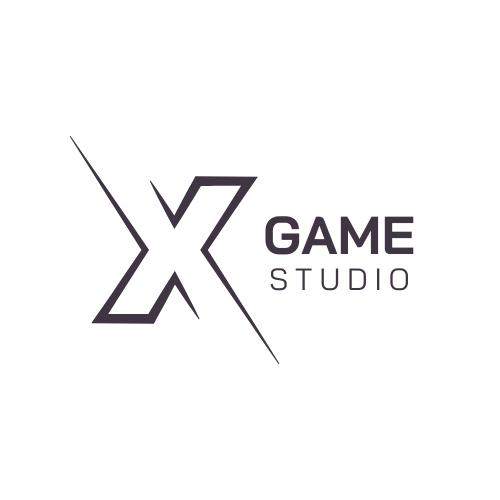

# 🎮 Game Studio - Plataforma de Jogos

<div style="text-align: center; margin: 20px 0;">


  
</div>


Uma plataforma moderna para descobrir, explorar e se conectar com os melhores jogos do mercado. Desenvolvido com paixão por gamers, para gamers.

## ✨ Recursos

- 🏠 Página inicial com destaques
- ℹ️ Página "Sobre Nós" com história do estúdio
- 📞 Página de contato com formulário funcional
- 🛠️ Página de serviços oferecidos
- 🔍 Sistema de pesquisa integrado
- 🎨 Design moderno e responsivo

## 🛠️ Tecnologias Utilizadas

- **Front-end**:
  - HTML5 semântico
  - CSS3 com variáveis e Flexbox/Grid
  - JavaScript
- **Design**:
  - Paleta de cores vibrantes
  - Efeitos modernos (gradientes, sombras)
  - Totalmente responsivo

## 🎨 Paleta de Cores

| Cor               | Hexadecimal                                                |
| ----------------- | --------------------------------------------------------- |
| Primary           |  `#6e00ff` |
| Secondary         |  `#ff00aa` |
| Dark Background   |  `#0f0a1a` |
| Light Text        |  `#f0e6ff` |
| Accent            |  `#00ffcc` |


## 🚀 Como Executar

1. Clone o repositório:
   ```bash
   git clone https://github.com/seu-usuario/game-studio.git

   cd xgame-studio
   ```


2. teste de commit...
